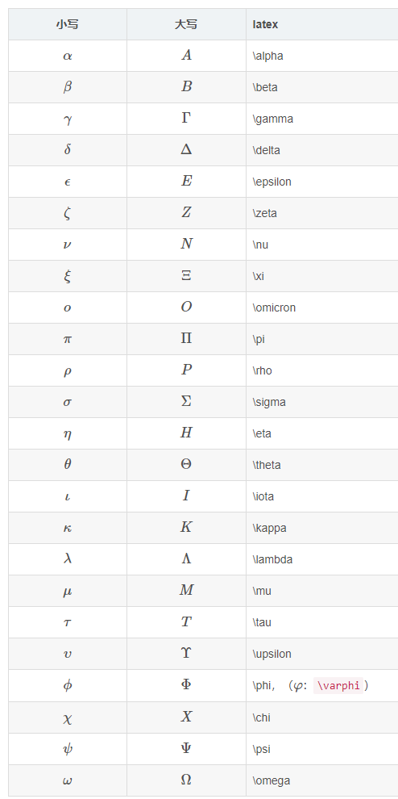

# 常用LaTex公式

详细请看这里：[链接](https://lindexi.gitee.io/post/Latex-%E5%85%AC%E5%BC%8F%E9%80%9F%E6%9F%A5.html)

## 希腊字母




## 运算符

```markdown
* 求和：\sum_{i=1}^n
* 积分: \int_1^n
* 极限: \lim_{x \to \infty}
* 分数: \frac{1}{2}
* 平方根: \sqrt{8}
* 公式对齐
\\
\begin{align*}
 f(x) &= (x+a)(x+b) \\
 &= x^2 + (a+b)x + ab
\end{align*}\\
* 
f(x)=\cases{{x+1}&{x>0}\\{1-x}&{x<0}}
显示效果如下：


加^号 输入\hat  或 \widehat

加横线 输入 \overline

加波浪线 输入 \widetilde

加一个点 \dot{要加点的字母}加两个点\ddot{要加点的字母}
```


$$
求和：\sum_{i=1}^n \\
积分: \int_1^n\\
极限: \lim_{x \to \infty}\\
分数: \frac{1}{2}\\
乘号：1\times 2\\
平方根: \sqrt{8}\\
公式对齐：
\\
\begin{aligned}
 f(x) &= (x+a)(x+b) \\
 &= x^2 + (a+b)x + ab
\end{aligned}\\
分段函数\\
f(x)=\cases{{x+1}&x>0\\{1-x}&x<0}
$$


$$
分数： 1/2 \qquad \frac{1}{2} \\

矩阵和行列式:\\
\begin{matrix}
1  & 2 & 3\\
2^2 & 3^3 & 4^4
\end{matrix}\\

X=\left|
	\begin{matrix}
		x_{11} & x_{12} & \cdots & x_{1d}\\
		x_{21} & x_{22} & \cdots & x_{2d}\\
		\vdots & \vdots & \ddots & \vdots \\
		x_{11} & x_{12} & \cdots & x_{1d}\\
	\end{matrix}
\right|
\\
\leftarrow \quad \rightarrow \quad \\
E=mc^2\\
$$

$$
H_x=\frac{1}{3}\times{
\left[ \begin{array}{lll}
1 & 0 & -1\\
1 & 0 & -1\\
1 & 0 & -1
\end{array} 
\right ]}
$$

$$
\left[ \begin{array}{lll}
A_{11} & A_{12} \\
A_{21} & A_{22}
\end{array}
\right]
\left[ \begin{array}{lll}
B_{11} & B_{12} \\
B_{21} & B_{22}
\end{array}
\right]
=
\left[ \begin{array}{lll}
C_{11} & C_{12} \\
C_{21} & C_{22}
\end{array}
\right]\\
$$

```latex
H_x=\frac{1}{3}\times{
\left[ \begin{array}{lll}
1 & 0 & -1\\
1 & 0 & -1\\
1 & 0 & -1
\end{array} 
\right ]}\\

分段函数\\
P_{r,j}=\left\{\begin{array}{ll}

0&\text{$r-j$ 为奇数},\\

r!\,(-1)^{(r-j)/2}&

\text{$r-j$ 为偶数}.

\end{array}
\right.\

```


$$
T(n)=\left\{\begin{array}{ll}
b&\text{$n\leq2$},\\
8\,T(n/2)+d\,n^2 &\text{$n>2$}.
\end{array}
\right.\
$$

$$
\begin{split}
T(n)&=2\,T(\frac{n}{2})+Cn\\
& = 2\left[2\,T(\frac{n}{4})+\frac{C\,n}{2}\right] +C\,n\\
& =4\,T(\frac{n}{4})+2\,C\,n \\
&=2^k\,T(\frac{n}{2^k})+k\,C\,n\\
&\downarrow \quad (2^k<n<2^{k+1})\\
&=n\,C_1 +C\,n\,\log n
\end{split}
$$

$$
\begin{aligned}
STEP\quad 1:\\
&cost(1,1)=0\\

STEP\quad 2:\\
&cost(2,2)=9 \\
&cost(2,3)=7 \\
&cost(2,4)=3 \\
&cost(2,5)= 2\\

STEP \quad 3:\\
&
cost(3,6)=\min
\left\{
\begin{aligned}
&cost(2,2)+c(2,6)\\
&cost(2,3)+c(3,6)\\
\end{aligned}
\right\}
=9\\
&
cost(3,7)=\min
\left\{
\begin{aligned}
&cost(2,2)+c(2,7)\\
&cost(2,3)+c(3,7)\\
\end{aligned}
\right\}
=11\\
&
cost(3,8)=\min
\left\{
\begin{aligned}
&cost(2,2)+c(2,8)\\
&cost(2,3)+c(3,8)\\
\end{aligned}
\right\}
=10\\
STEP \quad 4:\\
&
cost(4,9)=\min
\left\{
\begin{aligned}
&cost(2,2)+c(2,6)\\
&cost(2,3)+c(3,6)\\
\end{aligned}
\right\}=15\\
&
cost(4,10)=\min
\left\{
\begin{aligned}
&cost(2,2)+c(2,6)\\
&cost(2,3)+c(3,6)\\
\end{aligned}
\right\}=14\\
&
cost(4,11)=\min
\left\{
\begin{aligned}
&cost(2,2)+c(2,6)\\
&cost(2,3)+c(3,6)\\
\end{aligned}
\right\}=16\\

STEP \quad 5:\\
&
cost(5,12)=\min
\left\{
\begin{aligned}
&cost(4,9)+c(9,12)\\
&cost(4,10)+c(10,12)\\
&cost(4,11)+c(11,12)\\
\end{aligned}
\right\}=16\\
\end{aligned}
$$

$$
D(i,j)=\min \limits_{i\leq k <j}\left\{ D(i,k)+D(k+1,j)+r_{i-1}r_kr_j\right\}
$$

$$
\begin{aligned}
&D(1,1)=D(2,2)=D(3,3)=D(4,4)=0
\\STEP\quad 1:\\ j-i=1\\
&D(1,2)=D(1,1)+D(2,2)+10\times30\times70=21000\\
STEP \quad 2:\\
j-i=2\\
&
D(1,3)=\min
\left\{
\begin{aligned}
&D(1,2)+D(3,3)+r_0r_2r_3\\
&D(1,1)+D(2,3)+r_0r_1r_3\\
\end{aligned}
\right\}
\\
&
D(2,4)=\min
\left\{
\begin{aligned}
&D(2,2)+D(3,4)+r_1r_2r_4\\
&D(2,3)+D(4,4)+r_1r_3r_4\\
\end{aligned}
\right\}
\\

STEP \quad 3:\\
j-i=3\\
&
D(1,4)=\min
\left\{
\begin{aligned}
&D(1,1)+D(2,4)+r_0r_1r_4\\
&D(1,2)+D(3,4)+r_0r_2r_4\\
&D(1,3)+D(4,4)+r_0r_1r_3\\
\end{aligned}
\right\}

\end{aligned}
$$


$$
\begin{aligned}
STEP\quad 1:\\
&Bcost(5,12)=0\\

STEP\quad 2:\\
&Bcost(4,9)=4 \\
&Bcost(4,10)=2 \\
&Bcost(4,11)=5 \\

STEP \quad 3:\\
&
Bcost(3,6)=\min
\left\{
\begin{aligned}
&Bcost(4,9)+c(6,9)\\
&Bcost(4,10)+c(6,10)\\
\end{aligned}
\right\}
=7\\
&
Bcost(3,7)=\min
\left\{
\begin{aligned}
&Bcost(4,9)+c(6,9)\\
&Bcost(4,10)+c(6,10)\\
\end{aligned}
\right\}
=5\\
&
Bcost(3,8)=\min
\left\{
\begin{aligned}
&Bcost(4,10)+c(8,10)\\
&Bcost(4,11)+c(8,11)\\
\end{aligned}
\right\}
=7\\
STEP \quad 4:\\
&
Bcost(2,2)=\min
\left\{
\begin{aligned}
&Bcost(3,6)+c(2,6)\\
&Bcost(3,7)+c(2,7)\\
&Bcost(3,8)+c(2,8)\\
\end{aligned}
\right\}=7\\
&
Bcost(2,3)=\min
\left\{
\begin{aligned}
&Bcost(3,6)+c(3,6)\\
&Bcost(3,7)+c(3,7)\\
\end{aligned}
\right\}=14\\
&
Bcost(2,4)=
\begin{aligned}
&Bcost(3,8)+c(4,8)\\
\end{aligned}
=18\\
&
Bcost(2,5)=15\\
STEP \quad 5:\\
&
Bcost(1,1)=\min
\left\{
\begin{aligned}
&Bcost(2,2)+c(1,2)\\
&Bcost(2,3)+c(1,3)\\
&Bcost(2,4)+c(1,4)\\
&Bcost(2,5)+c(1,5)\\
\end{aligned}
\right\}=16\\
\end{aligned}
$$

$$
cost(i,j)=\min \limits_{k\in V_{i-1}}{cost(i-1,k)+c(k,j)}, \quad i=1,2,3,…
$$

TSP
$$
g(i,s)=\min_{k \in \xi}\left\{ c_{ik}+g(k,\xi-\{k\}) \right\}
$$

$$
D(\left\{\pi_c \right\}_{c=1}^k)=\sum_{c=1}^k\sum_{a_i\in\pi_c}||\phi(a_i)-m_c||^2\quad \quad 
m_c=\frac{\sum_{a_i\in\pi_c}\phi(a_i)}{\pi_c}
$$

$$
D(\left\{\pi_c \right\}_{c=1}^k)=\sum_{c=1}^k\sum_{a_i\in\pi_c}||a_i-m_c||^2\quad \quad 
m_c=\frac{\sum_{a_i\in\pi_c}a_i}{\pi_c}
$$

$$
g(S,t)=\min_{i \in S}\left\{ a_i+g(S-\{i\}),b_i+\max\{0,t-a_i\} \right\}
$$

