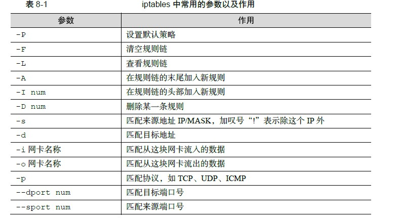

# 记录平时遇到的linux问题


## 虚拟机中不能复制粘贴

```shell
sudo apt-get autoremove open-vm-tools
sudo apt-get install open-vm-tools-desktop
sudo reboot
```


## 修改apt源

```shell
sudo mv /etc/apt/sources.list   /etc/apt/sources.list.bak

sudo vim /etc/apt/sources.list

# 添加以下内容
deb http://mirrors.aliyun.com/ubuntu/ bionic main restricted universe multiverse

deb-src http://mirrors.aliyun.com/ubuntu/ bionic main restricted universe multiverse

deb http://mirrors.aliyun.com/ubuntu/ bionic-security main restricted universe multiverse

deb-src http://mirrors.aliyun.com/ubuntu/ bionic-security main restricted universe multiverse

deb http://mirrors.aliyun.com/ubuntu/ bionic-updates main restricted universe multiverse

deb-src http://mirrors.aliyun.com/ubuntu/ bionic-updates main restricted universe multiverse

deb http://mirrors.aliyun.com/ubuntu/ bionic-backports main restricted universe multiverse

deb-src http://mirrors.aliyun.com/ubuntu/ bionic-backports main restricted universe multiverse

deb http://mirrors.aliyun.com/ubuntu/ bionic-proposed main restricted universe multiverse

deb-src http://mirrors.aliyun.com/ubuntu/ bionic-proposed main restricted universe multiverse


#更新apt-get
sudo apt-get update

sudo apt-get upgrade
```


## 修改pip源

在用户目录下创建*.pip/pip.conf*文件（Windows ：pip.ini）

```shell
mkdir .pip
cd .pip
vim pip.conf

[global]
index-url = https://pypi.tuna.tsinghua.edu.cn/simple
trusted-host = pypi.tuna.tsinghua.edu.cn
```


## 防火墙配置

在RHEL 7系统中， firewalld防火墙取代了 iptables防火墙。它们都只是用来定义防火墙策略的防火墙管理工具而已，或者说，它们只是一种服务。

它们都只是用来定义防火墙策略的防火墙管理工具而已，或者说，它们只是一种服务。 iptables服务会把配置好的防火墙策略交由内核层面的 netfilter网络过滤器 来处理，而 firewalld服务则是把配置好的防火墙策略交由内核层面的 nftables包过滤框架来处理。



例如，添加一条开放某个端口的规则：

```shell
iptables -A INPUT -p tcp --dport 2048 -j ACCEPT
```

注意，这样添加的只是临时规则，重启iptables服务后就会失效

```shell
# 这样才会添加到规则保存文件中
service iptables save

# 规则保存文件在这里
vim /etc/sysconfig/iptables
```

[这里有详细教程](https://www.91yun.co/archives/1690)


## 根据域名字段屏蔽某个网站

```shell
iptables -A OUTPUT -m string --string "xx.com" --algo bm --to 65535 -j DROP
service iptables save

#删除屏蔽规则，上面添加的代码是什么样，那么删除的代码就是把-I改成-D 
iptables -D OUTPUT -m string --string "xx.com" --algo bm --to 65535 -j DROP

-A
#添加iptables规则；
-D
#删除iptables规则（把添加防火墙规则时代码中的-A改成-D即可删除添加的规则）；
-m string
#指定模块；
--string "xx.com"
#指定要匹配的字符串(域名、关键词等)；
--algo bm
#指定匹配字符串模式/算法（还有一种更复杂的算法：kmp）；
--to 65535
#指定端口，这里代表所有端口（1-65535）；
-j DROP
#指匹配到数据包后处理方式，这里是丢弃数据包。

```


## Windows免密码登录Linux

1. 先在客户端生成密钥并上传公钥到linux上

```shell
# 打开命令行
ssh-keygen -t rsa
cd .ssh

# 通过scp上传，注意，如果改了ssh的端口，这里要加 -P 参数
scp id_rsa.pub  root@linux:~/
```

2. 将公钥添加到authorized_keys文件中

```shell
# 查看ssh配置是否符合要求
vim /etc/ssh/sshd_cofig

# 取消注释：
RSAAuthentication yes
PubkeyAuthentication yes
AuthorizedKeysFile    .ssh/authorized_keys

# 添加
cat id_rsa.pub >> .ssh/authorized_keys
chmod 600 .ssh/authorized_keys

systemctl restart sshd
```

